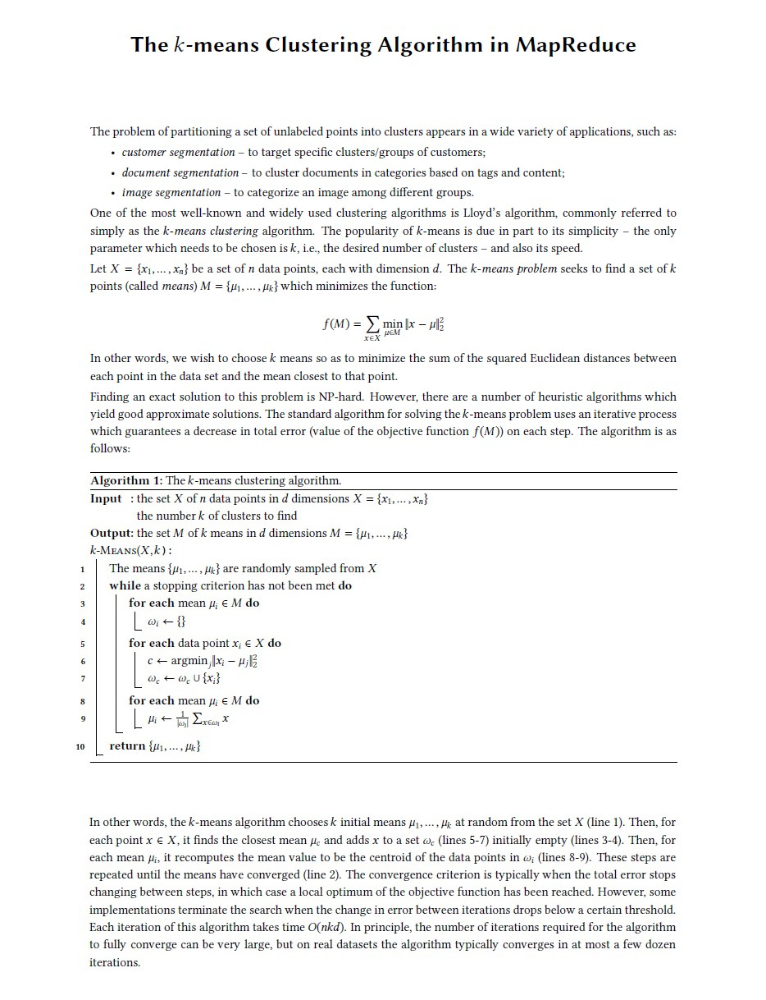

# The 𝑘-means Clustering Algorithm in MapReduce

Cloud Computing Project - University of Pisa

## Case Study Description



## What we are required to do

1. Design a MapReduce algorithm (using pseudocode) to implement the _k-means_ algorithm;
2. Implement the designed MapReduce algorithm using the Hadoop framework;
3. Test implementations on a synthetic or real-world dataset;
4. Write a short project report detailing your design, implementation and experimental results.

### For higher marks, please address efficiency issues in your implementation; examples include, but are not limited to, the following:

- Use combiners and/or more than 1 reducer;
- Use custom WritableComparable objects;
- Use the Mapper and Reducer classes setup and/or cleanup methods;
- Test your implementation on a range of different datasets, by varying values of 𝑛, 𝑑, and 𝑘

### Documentation Report

More details and final results are presents in the [Project Report Documentation](folder_utils/doc/Project_Report.txt)

## Quick Start

#### Login as "hadoop user" and go out of the root folder with "cd" command after execute following command line

```shell
sudo su -- hadoop
```

#### From the name node start the "name node, data nodes and secondary name node" with following command

```shell
start-dfs.sh
```
```
Output Expected:
    Starting namenodes on [hadoop-namenode]
    Starting datanodes
    Starting secondary namenodes [hadoop-namenode]
```

#### From the name node start the "resource manager" and "node managers" with following command

```shell
start-yarn.sh
```
```
Output Expected:
    Starting resourcemanager
    Starting nodemanagers
```

#### From the folder where the "dataset" was uploaded load it on hadoop distributed file system (HDFS)

```shell
hadoop fs -put /KMeans/data/points_set_1k.txt points_set_1k.txt
```

#### Locate in the main folder where the "project" was uploaded and where is present the pom.xml file

```shell
cd /KMeans
```

#### Clean and make new maven package. Run it with the pom.xml is

```shell
mvn clean package
```

#### Hadoop runable - java code Kmeans [input_file-Dataset_name] [output_folder_name]

```shell
hadoop jar target/KMeans-1.0-SNAPSHOT.jar it.unipi.dii.cc.hadoop.Kmeans points_set_1k.txt output_kmeans_1k
```

## Authors

* Francesco Bruno, f.bruno10@studenti.unipi.it - [ [@francescoB1997](https://github.com/francescoB1997) ]
* Gaetano Sferrazza, g.sferrazza@studenti.unipi.it - [ [@g-sferr](https://github.com/g-sferr) ]
* Leonardo Bargiotti, l.bargiotti@studenti.unipi.it - [ [@leobargiotti](https://github.com/leobargiotti) ]